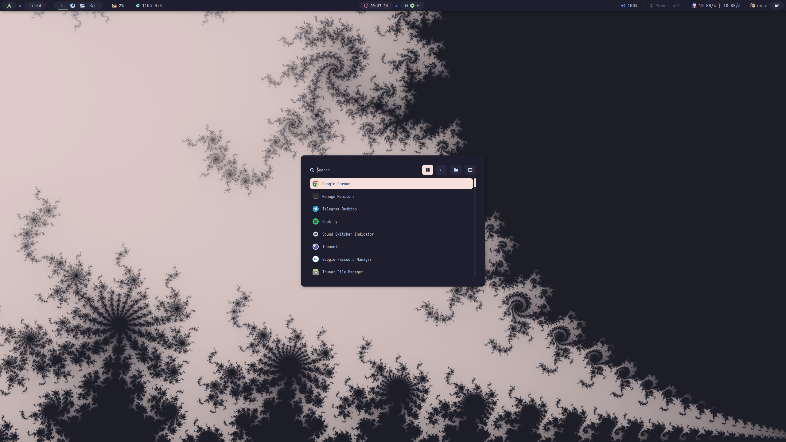

<h1 align="center"> Custom BSPWM config 🍚 :</h1>

> ✨ Inspired/fork/edit from **_Default_** theme by [**_adi1090x_**](https://github.com/adi1090x) from his Arch distro [**_Archcraft-os_**](https://github.com/archcraft-os/archcraft).

 Screenshot 🎞️ 

## 🌟 Credits :

- [**_adi1090x_**](https://github.com/adi1090x) ~ For his amazing distro, scripts and preconfigured BSPWM themes - [**_Archcraft-os_**](https://github.com/archcraft-os).
- [**_catppuccin_**](https://github.com/catppuccin) ~ For beautiful color palettes and ports.
