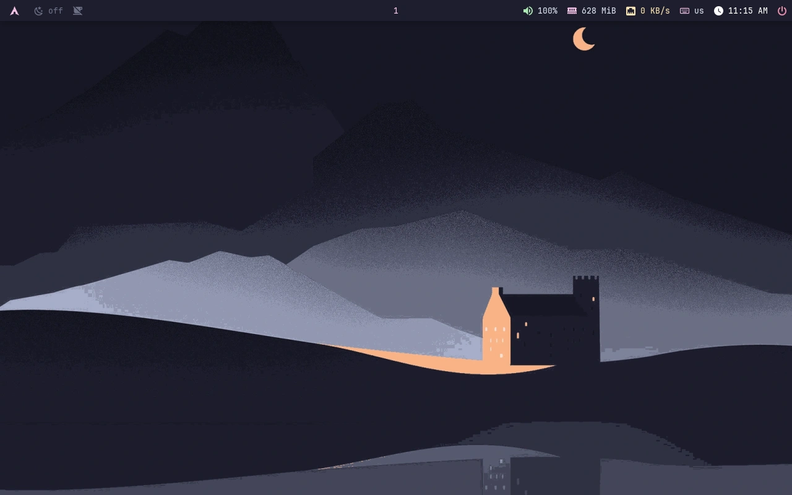

# BSPWM Dotfiles

*Read this in other languages:* [Español](README.es.md)

Autonomous, public, and minimal X11 desktop session based on **BSPWM** (Binary Space Partitioning Window Manager) styled with the Catppuccin Mocha theme. It functions completely standalone or composed with the primary modular dotfiles ecosystem.

<p align="center">
  
</p>

> [!NOTE]
> **Work in progress:** This repository is in active development and maintenance. It provides an independent X11 desktop experience and integrates with the base dotfiles at [anthonyportugal/dotfiles](https://github.com/anthonyportugal/dotfiles) (branch `refactor/modular-dotfiles`). *(Note: This repository will be renamed to `dotfiles-bspwm` upon migration completion).*

---

## 🧱 Modular Architecture

The BSPWM configuration is organized into cumulative profiles managed with [GNU Stow](https://www.gnu.org/software/stow/):

```text
┌────────────────────────────────────────────────────────────────────────┐
│                       BSPWM DESKTOP ECOSYSTEM (X11)                    │
│  ┌──────────────────────────────────────────────────────────────────┐  │
│  │                    DESKTOP PROFILE (UX & Tools)                  │  │
│  │  • Status Bar: Polybar (Catppuccin Pink, Dynamic Interfaces)     │  │
│  │  • App Launcher & Power Menu: Rofi                               │  │
│  │  • Notifications: Dunst                                          │  │
│  │  • Compositor & Shadows: Picom (GLX / XRender)                   │  │
│  │  • Wallpaper & Media: Feh, Playerctl, MPV-MPRIS                  │  │
│  └──────────────────────────────────────────────────────────────────┘  │
│  ┌──────────────────────────────────────────────────────────────────┐  │
│  │                      CORE PROFILE (Minimal X11)                  │  │
│  │  • Window Manager: BSPWM (Binary Space Partitioning)             │  │
│  │  • Hotkey Daemon: SXHKD                                          │  │
│  │  • X11 Auth & Keyboard Layouts: Xauth, Setxkbmap (US / Latam)    │  │
│  │  • Terminal: Alacritty (Catppuccin Theme)                        │  │
│  └──────────────────────────────────────────────────────────────────┘  │
└────────────────────────────────────────────────────────────────────────┘
```

---

## 🛠️ Approved Stack

| Capability | Selection | Description |
| :--- | :--- | :--- |
| **Window Manager** | `bspwm` | Binary space partitioning tiling manager |
| **Hotkey Daemon** | `sxhkd` | Simple X hotkey daemon |
| **Status Bar** | `polybar` | Edge-to-edge status bar with dynamic battery/network detection |
| **App Launcher** | `rofi` | Application launcher and power menu |
| **Compositor** | `picom` | Shadows, rounded corners, and opacity |
| **Notifications** | `dunst` | Minimal notification daemon |
| **Wallpaper** | `feh` | Wallpaper setter with interactive selector |
| **Audio / Media** | PipeWire & Playerctl | Modern audio stack with MPRIS media control |

---

## 🚀 Installation & Quickstart

### 1. Standalone Setup (Recommended)

```bash
mkdir -p "$HOME/.dotfiles/wm"
git clone https://github.com/anthonyportugal/bspwm.git "$HOME/.dotfiles/wm/bspwm"
cd "$HOME/.dotfiles/wm/bspwm"
```

### 2. Bootstrap the Environment

- **Full Desktop Experience (Recommended):**
  ```bash
  ./bin/bspwm bootstrap --profile desktop --apply
  ```
- **Minimal Core Session (No bar or visual effects):**
  ```bash
  ./bin/bspwm bootstrap --profile core --apply
  ```

### Helpful Bootstrap Flags
- **Dry-run simulation:** Omit `--apply` to preview actions without touching the system:
  ```bash
  ./bin/bspwm bootstrap --profile desktop
  ```
- **Diagnostics:** Check health and link integrity:
  ```bash
  ./bin/bspwm doctor --profile desktop
  ```
- **Unlink / Clean:** Remove managed symlinks safely:
  ```bash
  ./bin/bspwm unlink --profile desktop --apply
  ```

---

## 🔗 Integration with Base Dotfiles

While this repository operates **100% standalone**, it seamlessly integrates with the base dotfiles ecosystem:
- 🌐 **Primary Base Repository:** [anthonyportugal/dotfiles](https://github.com/anthonyportugal/dotfiles) *(Active branch: `refactor/modular-dotfiles`)*
- **Shared Ecosystem:** When installed alongside the base repository, Alacritty terminal styling, Zsh configurations, Neovim setups, and GTK theme preferences are shared effortlessly between X11 and Wayland sessions.

---

## ⌨️ Primary Keybindings

| Shortcut | Action |
| :--- | :--- |
| `Super + Return` | Open Alacritty terminal (Tiling) |
| `Super + Shift + Return` | Open floating Alacritty terminal |
| `Super + D` | Open Rofi application launcher |
| `Super + B` | Open default web browser (Brave) |
| `Super + E` | Open graphical file manager (Thunar) |
| `Super + L` | Lock screen immediately (slock / i3lock) |
| `Super + X` | Open session power menu (Rofi) |
| `Super + Shift + P` | Open interactive Power Profiles selector (Rofi) |
| `Super + Escape` | Restart BSPWM session and reload SXHKD |
| `Super + Shift + Escape` | Quit BSPWM session |
| `Super + T` | Toggle layout (*Tiled / Monocle*) |
| `Super + N` | Toggle warm night light (Redshift) |
| `Super + W` | Select wallpaper from gallery via Rofi (Feh) |
| `Alt + Space` | Toggle keyboard layout between US and Latin America |
| `Super + ?` / `Super + Shift + ?` | Open interactive keybindings cheat sheet |
| `Print` / `Super + S` | Fullscreen screenshot |
| `Super + Shift + S` | Interactive region screenshot with Satty annotation editor |
| `Super + R` / `Super + Shift + R` | Fullscreen / Interactive region screen recording (FFmpeg) |
| `Super + Alt + R` | Open screen recording audio options menu (Rofi) |
| `Super + C` / `Super + Shift + C` | Close / Kill focused window |

---

## 🧪 Testing & Verification

Run the automated test suite locally to verify links, configuration syntax, and session scripts:

```bash
./tests/bootstrap-smoke.sh
./tests/session-smoke.sh
```

---

## 📄 License

Original code and configuration are licensed under the [MIT License](LICENSE).
Catppuccin color schemes and third-party notices are attributed in `THIRD_PARTY_NOTICES.md`.
